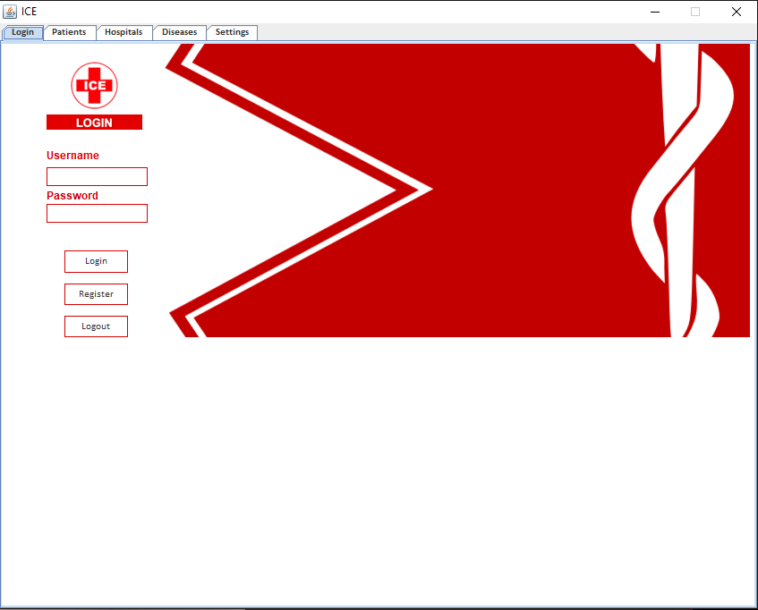
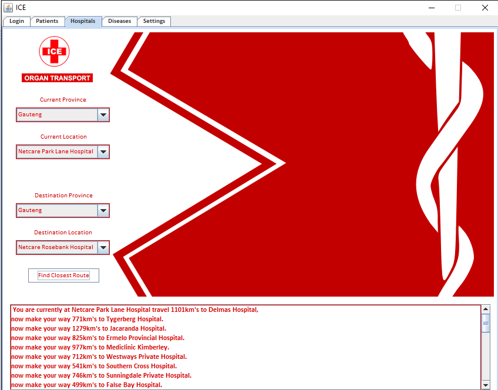
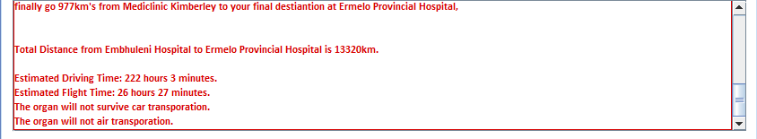
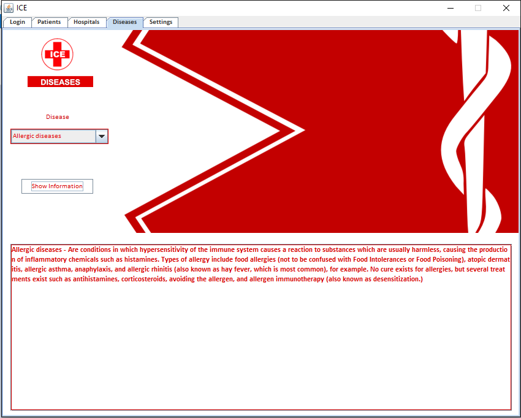

# ICE-Medical-Transport

Java application that makes use of the MAP-ADT to find the closest hospital for an organ donation/patient.

# How to use

- **Patients**
  - Patients will sign in and enter the hospital they are at and where they wish to go to.
  - A detailed GPS like summary of where to go with distances will be provided.
  - Patients can also see a list of diseases as well as information about said diseases.
  
- **Hospitals**

  - Hospitals will sign in and select their hospital as well as the hospital they would like to go to, be it for organ donation or patient     transfer.
  - A detailed GPS like summary of where to go with distances will be provided.
  - A estimate on the viabilty of the trip linked to organ-viabilty will be displayed.
  - Hospitals can add new hospitals and new disease-information

# Screenshots

- 

- 

- 

